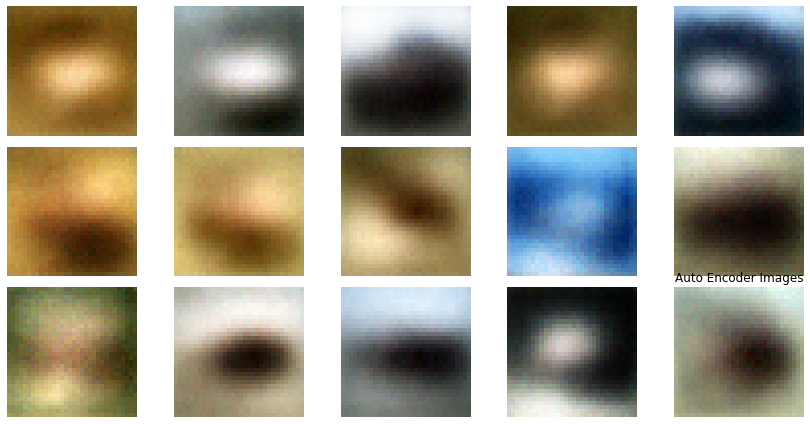
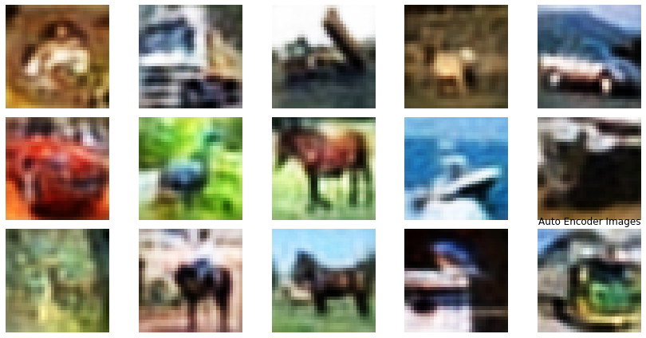

## AutoEncoder로 Cifar10을 학습 해보자.
  나는 내가 무언가를 이해하고 이론을 잘 알아야 한다기 보다는 '누군가 만들어 놓은 소스코드를 얼마나 잘 사용하는가'가 중요하다고 생각했다. 이것저것 찾아보다가 Gan이라는 것을 보게 되었는데 벽을 느끼게 되었다.

 내가 이론을 모르는 상태에서 이것을 잘 사용할 수 있겠는가..? 그래서 쉬운 것 부터 차근차근 공부하기로 마음을 먹었다.

 기본적인 이론들은 cs231n과 여러 친절하신 분들의 블로그를 보며 공부했다. 자세한 이론적인 부분은 내가 확실하게 말할 수 없기 때문에 구현한 코드와 여러 실험들에 대해 포스팅을 할 예정이다. 시작!

### Base Code
이곳의 코드를 Base로 구현 했다. 설명도 자세히 나와있어서 한 번 읽어보면 좋을 것 같다.
https://teddylee777.github.io/tensorflow/autoencoder

일단 필요한 모듈들을 import 해주자.
```python
import os

from tensorflow.keras.layers import Conv2D, Conv2DTranspose, Dense, Flatten, BatchNormalization, Reshape, LeakyReLU
from tensorflow.keras.models import Model
from tensorflow.keras.callbacks import ModelCheckpoint, EarlyStopping

from tensorflow.keras import Input

import tensorflow as tf
import numpy as np

import matplotlib.pyplot as plt
```

다음은 cifar10 데이터를 불러오고 preprocessing을 해준다.
```python
cifar10 = tf.keras.datasets.cifar10
(x_train, y_train), (x_valid, y_valid) = cifar10.load_data()

# -1 에서 1사이로 정규화 해준다.
x_train = x_train.reshape(-1, 32, 32, 3)
x_train = x_train / 127.5 - 1
x_valid = x_valid.reshape(-1, 32, 32, 3)
x_valid = x_valid / 127.5 - 1
```

Encoder는 Conv2D 필터 수를 32-64-64-64로 하고 최종 latent(code)의 수는 10개로 하였다.
```python
### Encoder 정의
encoder_input = Input(shape=(32,32,3))

x = Conv2D(32, 3, strides=1, padding='same')(encoder_input)
x = BatchNormalization()(x)
x = LeakyReLU()(x)

x = Conv2D(64, 3, strides=2, padding='same')(x)
x = BatchNormalization()(x)
x = LeakyReLU()(x)

x = Conv2D(64, 3, strides=2, padding='same')(x)
x = BatchNormalization()(x)
x = LeakyReLU()(x)

x = Conv2D(64, 3, padding='same')(x)
x = BatchNormalization()(x)
x = LeakyReLU()(x)

x = Flatten()(x)

encoder_output = Dense(10)(x)

encoder = Model(encoder_input, encoder_output)
```

Decoder는 Conv2DTranspose 를 사용하여 Encoder와 대칭이 되도록 구성하면 된다.
최종 output은 cifar10이 3채널 이미지 이기 때문에 필터 개수를 3으로 해준다.
```python
### Decoder 정의
decoder_input = Input(shape=(10,))

x = Dense(8*8*64)(decoder_input)
x = Reshape((8, 8, 64))(x)

x = Conv2DTranspose(64, 3, strides=1, padding='same')(x)
x = BatchNormalization()(x)
x = LeakyReLU()(x)

x = Conv2DTranspose(64, 3, strides=2, padding='same')(x)
x = BatchNormalization()(x)
x = LeakyReLU()(x)

x = Conv2DTranspose(64, 3, strides=2, padding='same')(x)
x = BatchNormalization()(x)
x = LeakyReLU()(x)

x = Conv2DTranspose(32, 3, strides=1, padding='same')(x)
x = BatchNormalization()(x)
x = LeakyReLU()(x)

decoder_output = Conv2DTranspose(3, 3, strides=1, padding='same', activation='tanh')(x)

decoder = Model(decoder_input, decoder_output)
```

AutoEncoder 모델은 다음과 같이 정의된다.
```python
encoder_in = Input(shape=(32,32,3))
x = encoder(encoder_in)
decoder_out = decoder(x)

auto_encoder = Model(encoder_in, decoder_out)
```

Hyper Parameter들을 정의한다.
```python
LEARNING_RATE = 0.00001
BATCH_SIZE = 32
```

학습을 시킨다.
callback을 정의해 주어 loss가 두 번 동안 떨어지지 않으면 학습을 중단하도록 했다.
```python
auto_encoder.compile(optimizer=tf.keras.optimizers.Adam(LEARNING_RATE),
                     loss=tf.keras.losses.MeanSquaredError())

model_dir = './latent10/'
os.mkdir(model_dir)
model_path = model_dir + '{epoch}__loss_{loss}.h5'

checkpoint_callback = ModelCheckpoint(model_path,
                                      save_best_only=True,
                                      save_weights_only=False,
                                      monitor='loss',
                                      verbose=1)
earlystop_callback = EarlyStopping(monitor='loss',
                                   patience=2)

auto_encoder.fit(x_train, x_train,
                 batch_size=BATCH_SIZE,
                 epochs=100,
                 callbacks=[checkpoint_callback, earlystop_callback])
```

결과 시각화
```python
# 원본 이미지 15개 출력
fig, axes = plt.subplots(3, 5)
fig.set_size_inches(12, 6)
for i in range(15):
    t = x_train[i]
    t = (t-t.min())/(t.max()-t.min())*255
    axes[i//5, i%5].imshow(t.astype(np.uint8))
    axes[i//5, i%5].axis('off')
plt.tight_layout()
plt.title('Original Images')
plt.show()
```


```python
# 오토 인코더가 생성한 이미지 15개 출력
decoded_images = auto_encoder.predict(x_train[:15])

fig, axes = plt.subplots(3, 5)
fig.set_size_inches(12, 6)
for i in range(15):
    t = decoded_images[i]
    t = (t-t.min())/(t.max()-t.min())*255
    axes[i//5, i%5].imshow(t.astype(np.uint8))
    axes[i//5, i%5].axis('off')
plt.tight_layout()
plt.title('Auto Encoder Images')
plt.show()
```


결과가 처참하다..


### Denoise을 적용해보자.

AutoEncoder 에 Denoise라는 기술이 있는데 이는 학습시킬때 입력 이미지에 noise를 주는 것이다.
이러면 학습을 더 잘한다고 한다. 예를 들면 이런 것이다. 멀쩡한 개구리를 주고 개구리를 만들어 내는 것과 조금 문제있는 개구리를 주고 개구리를 만들어 내는 것중에 어떤 것이 개구리의 특징을 더 잘 뽑을 것이냐 하는것이다.


Denoise를 적용한 결과이다.
Denoise는 Encoder 입력부분을 이렇게 바꿔주기만 하면 된다.
```python
encoder_input = Input(shape=(32,32,3))

x = encoder_input + 0.1*np.random.randn(32,32,3)
x = Conv2D(32, 3, strides=1, padding='same')(x)
...
...
```

뭔가 선명해진 듯한 착각이 들긴 하지만 Denoise는 이를 해결 하지 못한 것 같다. 일단 좋다니까 쓰기로 한다.

### Latent의 수를 늘려보자.

어쩌면 latent의 수가 cifar10 이미지를 재구성하기에는 부족한 것이 아닐까 하는 생각에 512개로 과감하게 늘려보았다.
latent수는 Encoder의 출력부분과 Decoder의 입력부분을 이렇게 바꿔주기만 하면된다.

```python
...
...
x = Flatten()(x)

encoder_output = Dense(512)(x)

encoder = Model(encoder_input, encoder_output)

decoder_input = Input(shape=(512,))

x = Dense(8*8*64)(decoder_input)
x = Reshape((8, 8, 64))(x)
...
...
```


화질이 조금 낮은 것을 빼면 엄청난 결과라고 생각된다...

latent를 늘려봤으니 층도 늘려봐야겠다는 생각에 층도 256-256-128-128-64-64-64로 과감하게 늘려 보았다.



아쉽게도 층을 늘린 것은 큰 영향이 없어 보인다.

다음 포스팅은 AutoEncoder의 다양한 변형들에 대해 실험하고 올릴 예정이다.

화이팅


